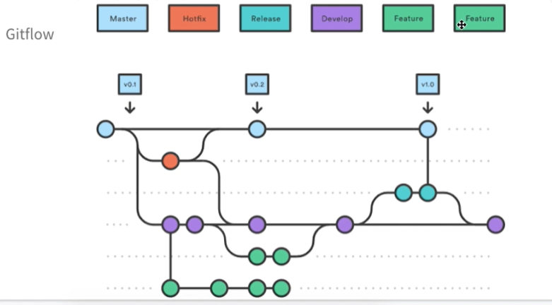

# Comandos

- git init
- git clone
- git add
- git commit
- git push
- git branch
- git tag
  - le agrega una etiqueta a algún commit, es para release, un lanzamiento, hotfix o cualquier etiqueta.
- git pull
  - trae la ultima versión de una rama del servidor
- git checkout -b NAME
  - crea una rama con nombre NAME
- git comando --help
  - muestra información de lo que hace ese comando

# Gitflow

GitFlow es un flujo de trabajo basado en git.
Giflow ayuda a dar un estándar de nomenclatura de ramas, se busca evitar los conflictos. 
Permite trabajar en equipo.
Es un modelo estricto de ramificación, es estricto porque se debe tener un prefijo para cada rama y cada rama tiene un significado, cada rama debe surgir de otra rama específica y debe ser mergeada a una rama específica.

En las ramas principales se tiene a **main/master** y a **develop**

## Ramas

- main
- develop

- otras
  - feature/   utilizada para cuando se está trabajando en una nueva funcionalidad o alguna modificación
  - bug/       utilizada para algún error que se está corrigiendo
  - support/
  - release/   utilizada para cuando estamos lanzando una nueva versión, acá haremos todas las pruebas para posteriormente lanzarlo a producción (lanzar a producción = merge a main)
  - hotfix/    utilizada para corregir algún error que está en producción para posteriormente integrarse a main

tanto *release* como *hotfix* deben integrarse a main. Release es un lanzamiento planeado, hotfix es para agregar parches a algo que ya está en producción.

## Flujo de trabajo con gitflow tradicional

**cada vez que cambio de rama debo hacer un git pull origin rama**

imaginemos que estamos en v0.1 y surge un error en producción, entonces sacamos una rama hotfix de main para arreglar ese problema, esa rama hotfix debe ser integrada inmediatamente a main, al hacer el merge a main pasa a ser v0.2, se recomienda darle un tag a todo lo que está en producción. Posteriormente la rama hotfix también debe integrarse a la rama develop para que los programadores que están haciendo alguna tarea ya tengan ese parche.

main -> hotfix -> main con nueva versión
               -> develop

la rama develop es tipo un contenedor de lo que están haciendo los otros programadores.

main -> develop -> feature 1 ->
                -> feature 2 ->  develop -> release (pruebas) -> master con nueva versión
                -> feature 3 ->                               -> develop para actualizarla

## GitGraph

extensión para ver el flujo de las ramas

**es recomendable que cuando se saque una nueva rama hay que actualizar lo ultimo**

## Ejercicio 1

### Cambio 1 - feature

- para agregar una rama al repositorio remoto, en este caso develop
  - git checkout -b develop
  - git push -u origin develop

- luego de subir terminar el feature (develop -> feature) hay que hacer un pull request para que feature -> develop.

- luego de hacer el pull se debe hacer el **merge** del pull request.

### Cambio 2 - feature

### Cambio 3 - hotfix

main -> hotfix -> main
                        -> develop 

**cuando hago un merge a la main se recomienda hacer un tag de eso**
- para hacer el tag
  - ubicarme en la rama main
  - actualizar la main con git pull origin main
    - git tag -a v1.1.0 -m "version 1.1.0"
    - git push -u origin v1.1.0

### Cambio 4 - release

develop -> release -> main
                          -> develop

